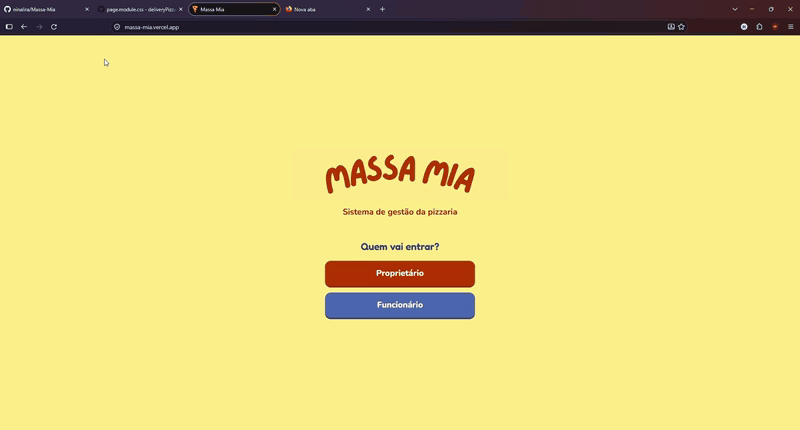
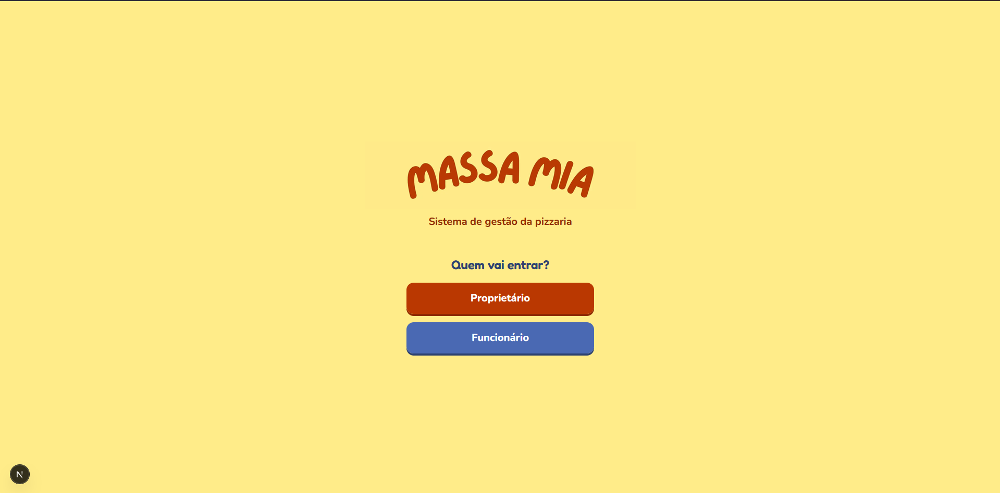
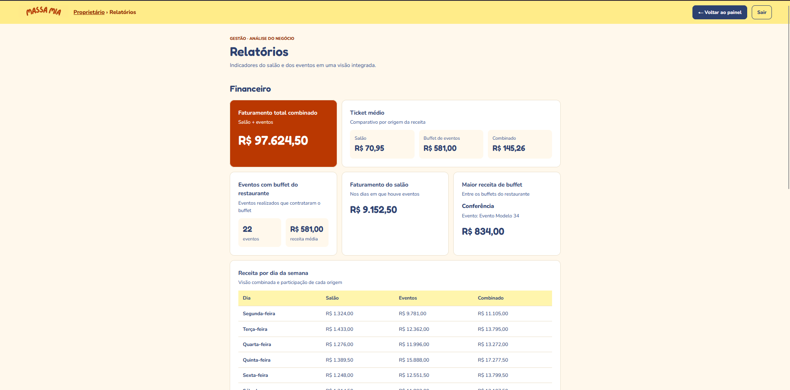
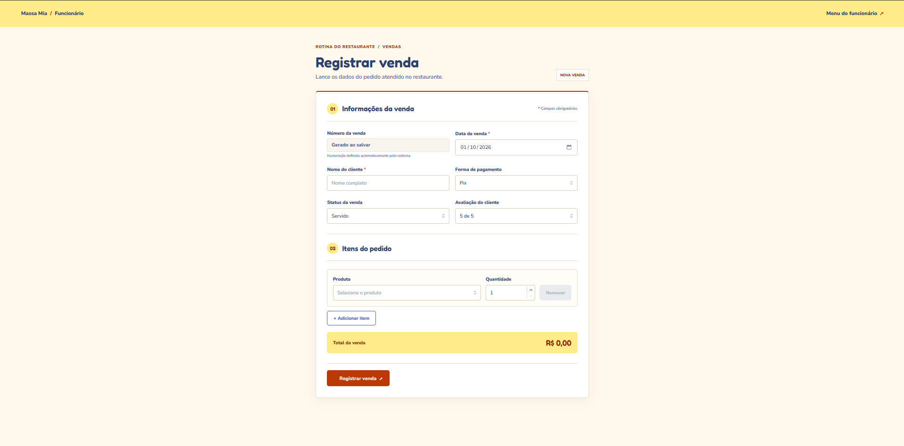
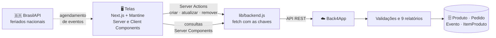

# 🍕 Massa Mia — Sistema de Gestão de Pizzaria

**Do programa Java no terminal para um site com banco de dados na nuvem.** Projeto acadêmico que transforma a gestão de uma pizzaria em uma aplicação web completa: o dono acompanha vendas, eventos e relatórios; o funcionário registra pedidos e agenda eventos — tudo salvo em um banco de dados na nuvem.


➡️ **[Site publicado](#-demonstração)** · **[Vídeo no YouTube](#-demonstração)** · **[Como rodar](#-como-rodar-localmente)**

## 🎬 Demonstração

Navegação real pelo site: tela de entrada, área do proprietário e tabela de eventos com ordenação.



⚡ *Gravação real do site em produção.*

| Acesso | Link |
|---|---|
| 🌐 Site publicado no Vercel | *[link](https://massa-mia.vercel.app)* |
| 📺 Vídeo completo no YouTube (até 4 min, com CRUD) | *[link]* |

## 🎯 O projeto

O Massa Mia nasceu de um trabalho de disciplina: um sistema de gestão de pizzaria que antes era um **programa Java no terminal** — onde os dados ficavam só na memória e se perdiam ao fechar o programa. Ele virou um **site completo**, com banco de dados na nuvem e duas áreas de acesso.

| Sem o site 😕 | Com o site 🍕 |
|---|---|
| Programa Java no terminal | Site em Next.js publicado no Vercel |
| Dados só na memória — fechou, perdeu tudo | Banco na nuvem (Back4App), sempre disponível |
| Cálculos manuais no terminal | 9 relatórios calculados no servidor, em cartões |
| Uma única pessoa usando o programa | Áreas separadas para proprietário e funcionário |
| Nenhuma validação | Validação em camadas: navegador, servidor e banco |

## ✨ Funcionalidades

**Área do funcionário** — a rotina do restaurante:

- 🧾 **Registrar venda** — cliente, data, forma de pagamento, status e itens do pedido, com **total calculado ao vivo** enquanto os produtos são escolhidos.
- 📋 **Vendas** — consulta das vendas registradas, com possibilidade de remover um lançamento errado.
- 📅 **Agendar evento** — data, responsável, capacidade, valor do ingresso e **buffet opcional** (a data informada é enriquecida com o **feriado nacional** consultado em API externa).
- 🔄 **Eventos** — atualiza o status do evento (realizado ou cancelado) direto na tabela e remove eventos.

**Área do proprietário** — a visão do negócio:

- 💰 **Vendas** — todas as vendas com itens, status e total, **ordenáveis por qualquer coluna**.
- 🎪 **Eventos** — público, buffet, valores e status de cada evento.
- 📊 **Relatórios** — as 9 perguntas do dono em cartões: financeiro, produtos mais consumidos e satisfação média.

**Detalhes que fazem diferença:**

- ✅ **Validação em camadas** — o navegador confere os campos, o servidor confere de novo e o banco (Cloud Code) recusa o que escapar.
- 🏷️ **Status em etiquetas coloridas** — Servido, Cancelado, Agendado e Realizado sempre legíveis.
- 🧭 **Tabelas ordenadas pela URL** — clicar no cabeçalho grava a ordenação no endereço (`?sort=data&direction=asc`): o estado vive na URL, não só na tela.
- 🛡️ **Nada quebra** — sem dados ou com o banco fora do ar, a tela mostra uma mensagem em vez de um erro.
- 🖥️ **Acessibilidade** — foco visível pelo teclado, `aria-sort` nas colunas, `role="alert"` nos erros, contraste alto e confirmação antes de apagar.

## 🖼️ As telas

| Entrada — "Quem vai entrar?" | Relatórios do proprietário |
|---|---|
|  |  |

| Registrar venda — total ao vivo |
|---|
|  |

## 🧠 Arquitetura

As telas **nunca falam direto com o banco**: toda conversa passa pelas funções de `lib/backend.js`, que rodam no servidor — as chaves de acesso ficam no `.env.local` e nunca chegam ao navegador.



- **Server Components** buscam os dados já prontos no servidor (Vendas, Eventos, Relatórios).
- **Client Components** reagem a cliques e digitação (formulários, total ao vivo, botão de remover).
- **Server Actions** gravam no banco sem expor nenhuma rota de API.
- **Cloud Code** no Back4App centraliza as regras: numeração automática, status e datas válidas, itens ligados a um pedido *ou* a um evento — e a remoção em cascata dos itens quando um pedido ou evento é apagado.

## 🗄️ Modelo de dados

Quatro classes no Back4App, traduzidas diretamente do sistema Java original:

| Classe | O que guarda | Destaques |
|---|---|---|
| `Produto` | Cardápio: pizzas e bebidas | categoria, tamanho e preço |
| `Pedido` | Venda do salão | numeração automática, status, avaliação e forma de pagamento |
| `Evento` | Eventos com buffet do restaurante | ingressos, capacidade, público real e avaliação |
| `ItemProduto` | Pizza ou bebida de um pedido ou do buffet | ponteiro para o `Produto`; pertence a **um pedido ou a um evento** (nunca aos dois) |

**Onde o CRUD acontece:** registrar venda cria `Pedido` + `ItemProduto`; agendar evento cria `Evento` (+ buffet); as tabelas consultam tudo; o status do evento é atualizado na própria linha; vendas e eventos são removidos com confirmação — e o Cloud Code apaga em cascata os itens órfãos.

## 🛠️ Tecnologias

| Camada | Tecnologia | Como usamos |
|---|---|---|
| Framework | **Next.js 16** (App Router) | Cada pasta em `app/` vira uma página |
| Interface | **React 19** | Componentes que devolvem a interface |
| Componentes | **Mantine 9** | Botões, campos e alertas com tema próprio do projeto |
| CSS | **CSS Modules** | CSS por tela, com classes que não se misturam |
| Fontes | **next/font** | Fredoka nos títulos, Nunito nos textos |
| Banco e regras | **Back4App** (Parse) | 4 classes + Cloud Code (validações e relatórios) |
| API externa | **BrasilAPI** | Feriados nacionais no agendamento de eventos — sem chave de acesso |
| Deploy | **Vercel** | Publicado direto do repositório GitHub |

## 🚀 Como rodar localmente

1. **Dependências**

   ```bash
   npm install
   ```

2. **Configure o Back4App** — crie um app gratuito em [back4app.com](https://www.back4app.com/) e um arquivo `.env.local` na raiz:

   ```env
   PARSE_SERVER_URL=https://parseapi.back4app.com
   PARSE_APP_ID=sua_application_id
   PARSE_JS_KEY=sua_javascript_key
   ```

3. **Rode o site**

   ```bash
   npm run dev
   ```

   Abra [http://localhost:3000](http://localhost:3000).

4. **(Opcional) Popule com dados de exemplo** — 160 pedidos, 40 eventos e o cardápio:

   ```bash
   PARSE_MASTER_KEY=sua_master_key node backend/seed.js
   ```

   O script se protege: se o banco já tiver dados, nada é gravado.

5. **Cloud Code** — o conteúdo de `backend/main.js` (validações) e `backend/relatorios.js` (as 9 perguntas) vai no dashboard do Back4App, em *Cloud Code*.

## 🗺️ Requisitos do projeto

| Status | Requisito |
|---|---|
| ✅ | Entrada do proprietário e do funcionário |
| ✅ | Registrar venda com itens e total calculado ao vivo |
| ✅ | Listar e remover vendas e eventos |
| ✅ | Agendar evento com buffet opcional |
| ✅ | Atualizar status do evento |
| ✅ | Os 9 relatórios do dono |
| ✅ | Validações em camadas, iguais às do sistema Java |
| ✅ | Dados guardados no banco na nuvem (Back4App) |
| 🚧 | **Login de verdade** — hoje é de demonstração, com usuário e senha fixos |
| 🚧 | **Versão para celular** — o site foi pensado para computador |
| 🚧 | **Editar uma venda** — dá para registrar e remover, mas não alterar |

## 👥 Equipe

| Nome | RA | GitHub |
|---|---|---|
| *Heitor Farias Santos* | *853409* | [heitorfariass](https://github.com/heitorfariass) |
| *Nina Lira Henriques de Araújo* | *854887* | [ninalira](https://github.com/ninalira). |
| *Camila Danielle Ramos Torquato* | *854556* | [camilatorquato](https://github.com/camilatorquato) |
| *[Nome]* | *[RA]* | [@usuario](https://github.com/) |
| *[Nome]* | *[RA]* | [@usuario](https://github.com/) |

## 🔗 Entrega

- 💻 **Código no GitHub:** você já está aqui — *[link do repositório](https://github.com/ninalira/Massa-Mia)*
- 🌐 **Site publicado:** *[link do Vercel](https://massa-mia.vercel.app)*
- 📺 **Vídeo de demonstração (YouTube, até 4 min):** *[link]*

## 📄 Licença

Este projeto está sob a licença [MIT](LICENSE) — sinta-se livre para estudar, reproduzir e adaptar.

---

Feito com 🍕 por estudantes que acreditam que software bom é software que resolve o problema de verdade.
